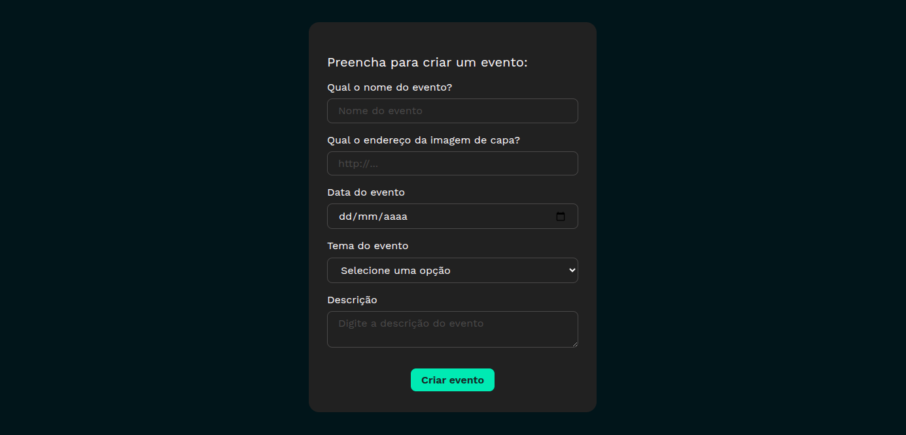
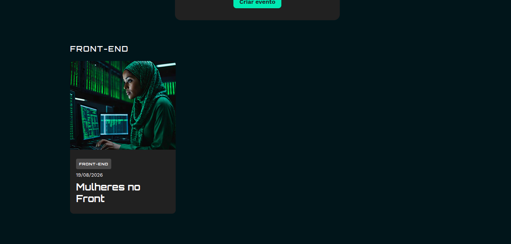

# 🚀 Tecboard

Aplicação desenvolvida em React para o gerenciamento de eventos de tecnologia baseado em um tema específico. É possível cadastrar e visualizar os eventos criados na tela principal da aplicação.

## 📸 Preview




## 🛠️ Tecnologias

- React
- Vite
- JavaScript
- CSS

## 📦 Instalação

```bash
npm install
```

## Execução do projeto

```bash
npm run dev
```

## 📚 Documentação

Durante o desenvolvimento do projeto, foram estudados diversos conceitos relacionados ao React, JavaScript e Vite.

- 📖 [Conceitos estudados](./docs/concepts.md)